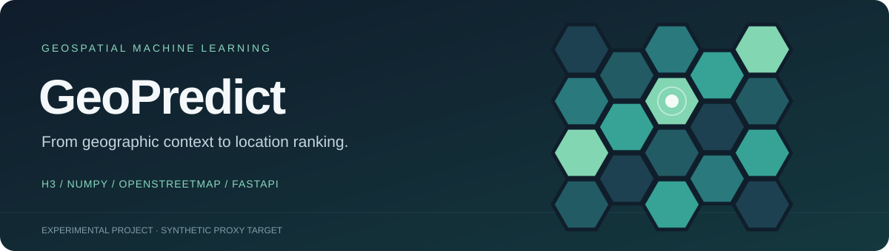
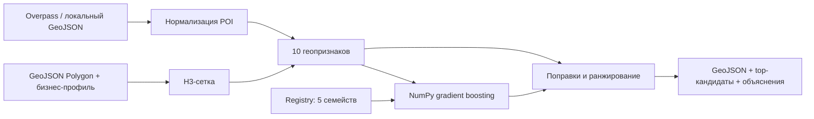

<p align="center">
  
</p>

# GeoPredict

**Геомаркетинговый ML-прототип: от полигона на карте до объяснимого рейтинга локаций.**

GeoPredict разбивает выбранную территорию на H3-ячейки, извлекает признаки окружения из OpenStreetMap и ранжирует участки для разных типов бизнеса. Внутри — собственный градиентный бустинг на NumPy, модельный registry и FastAPI. Результат возвращается в GeoJSON и подходит для отображения на карте.

**Статус:** исследовательский прототип с синтетической целевой переменной. Оценка отражает заданную proxy-модель привлекательности территории; она не является прогнозом выручки или вероятностью успеха бизнеса.

[Быстрый старт](#быстрый-старт) · [API](#api) · [Модель и оценка](#модель-и-оценка) · [Техническое руководство](docs/TECHNICAL_GUIDE.md)

## Возможности

| Компонент | Реализация |
|---|---|
| Геообработка | GeoJSON Polygon → H3, разрешения 7–10, до 1 000 ячеек на запрос |
| Признаки | 10 признаков: конкуренция, плотность POI, жильё, транспорт, офисы, торговые и образовательные объекты |
| ML | Градиентный бустинг из decision stumps на NumPy; 5 семейств моделей для 10 бизнес-профилей |
| Ранжирование | Итоговый score с поправками на полноту данных и насыщение конкурентами, top-кандидаты и объяснения |
| Данные | Overpass API, файловый кэш, резервный endpoint, локальный GeoJSON для воспроизводимого демо |
| Интерфейсы | Python CLI, FastAPI, OpenAPI/Swagger, Docker |

Поддерживаются ПВЗ, кофейни, пивные магазины/бары, аптеки, продуктовые магазины, фастфуд, рестораны, салоны красоты, клиники и автосервисы. Свободный запрос создаёт общий `custom_osm`-профиль; отдельной обученной модели для него нет.

**Стек:** Python 3.11+, NumPy, pandas, H3, Pydantic, FastAPI, Uvicorn, GeoJSON, OpenStreetMap/Overpass, Docker Compose.

## Как устроен анализ



Основные части отделены друг от друга: геометрия и сетка → источники данных → признаки → модель → политика выбора. Подробные формулы и пороги приведены в [техническом руководстве](docs/TECHNICAL_GUIDE.md).

## Быстрый старт

Команды выполняются из корня репозитория. Для демонстрационного анализа сеть нужна только при установке зависимостей: POI и модель уже включены в репозиторий.

```bash
git clone https://github.com/guguker/GeoPredict.git
cd GeoPredict
python3 -m venv .venv
source .venv/bin/activate
python -m pip install -r requirements.txt

python -m scripts.analyze_polygon \
  --request data/sample/request_pvz.json \
  --pois data/sample/osm_pois_pvz_sample.geojson \
  --model models/geopredict_pickup_point_v1.pkl \
  --output out/pvz_analysis.geojson
```

На Windows окружение активируется командой `.venv\Scripts\activate`. Отдельная инструкция для live-запуска: [RUN_LIVE_WITHOUT_DOCKER.md](RUN_LIVE_WITHOUT_DOCKER.md).

В `out/pvz_analysis.geojson` появится `FeatureCollection`: геометрия ячеек, признаки, ранги и сводка `metadata.top_candidates`. Пример чтения результата:

```python
import json
from pathlib import Path

result = json.loads(Path("out/pvz_analysis.geojson").read_text())
print("Источник:", result["metadata"]["data_sources"])
print("Сетка:", result["metadata"]["grid_backend"])
for candidate in result["metadata"]["top_candidates"][:3]:
    print(candidate["rank"], candidate["h3_id"], candidate["suitability"])
```

CLI с локальным GeoJSON передаёт POI напрямую; пометка источника в CLI не удостоверяет актуальность данных. Для API демонстрационный режим явно обозначен `data_mode="mock"`.

Для свежих OSM-данных замените `--pois ...` на `--live-osm`. Доступность и полнота результата зависят от Overpass и покрытия OSM.

## API

```bash
python -m uvicorn api.analyze:app --host 127.0.0.1 --port 8000
```

- [Swagger UI](http://127.0.0.1:8000/docs) — интерактивные запросы.
- `GET /health` — доступность API.
- `GET /business-types` — каталог профилей и подсказки через `?query=`.
- `POST /analyze` — анализ полигона.

В другом терминале отправьте готовый запрос для демо без Overpass:

```bash
curl -X POST http://127.0.0.1:8000/analyze \
  -H 'Content-Type: application/json' \
  --data-binary @data/sample/request_pvz_mock.json
```

Для live-режима используйте `@data/sample/request_pvz.json`. Если Overpass недоступен и подходящего кэша нет, API возвращает `503 osm_unavailable`. Демо доступно только для ПВЗ в области включённого московского полигона.

| Поле ответа | Смысл |
|---|---|
| `model_score` | Сырой выход регрессионной модели |
| `suitability`, `selection_score` | Итоговая proxy-оценка от 0 до 1 |
| `data_confidence` | Эвристическая оценка полноты сигналов |
| `rank` | Позиция ячейки внутри выбранного полигона |
| `explanation`, `poi_counts` | Факторы рекомендации и число объектов окружения |
| `metadata.data_status` | `live`, `cached`, `mock` или `insufficient` |

Поле `success_probability` сохранено в контракте как алиас итогового score. **Это не статистически откалиброванная вероятность.** Полный контракт и ошибки: [docs/API.md](docs/API.md).

## Модель и оценка

[`GradientBoostingRegressorLite`](geopredict_ml/model.py) последовательно обучает небольшие деревья из одного разбиения на остатках текущего прогноза. По умолчанию используется 48 деревьев, learning rate 0.12 и до 12 порогов на признак. Пять артефактов и их бизнес-профили перечислены в [manifest](models/manifest.json).

Reference-обучение использует **синтетическую сетку признаков**. `target_success` вычисляется формулой с весами бизнес-профиля. Поэтому метрики оценивают приближение этой формулы, а не успешность реальных открытий.

```bash
# Holdout с фиксированным seed и сравнением с train-mean baseline
python -m scripts.evaluate_model \
  --dataset data/processed/pvz_features.csv \
  --fit-holdout --test-size 0.25 --seed 42

# При необходимости пересоздать registry моделей
python -m scripts.train_all_models --models-dir models
```

Демонстрационный CSV содержит 12 строк: его достаточно для проверки процесса, но недостаточно для вывода об обобщающей способности. В сохранённой оценке артефакта mean baseline оказался лучше модели; значения и ограничения приведены в [разделе оценки](docs/TECHNICAL_GUIDE.md#16-метрики-качества-модели). Собственных заявлений о точности на реальном бизнесе проект не делает.

Для полноценной проверки нужны исторические результаты работы точек, временное и географическое разделение данных, сравнение с простыми baseline и анализ утечек между соседними локациями.

## Docker и интеграция

API запускается независимо от других сервисов:

```bash
docker compose up --build
```

`docker-compose.full.yml` — дополнительный локальный сценарий с картографическим frontend, отдельным auth-сервисом и PostgreSQL. **Frontend и auth-код не входят в этот репозиторий.** Для этого сценария нужны соседние каталоги `../geo_mark_front` и `../express-auth-service`, а также собственные значения в `.env`:

```bash
cp .env.example .env
# Задайте локальные пароли и два независимых JWT-секрета в .env
docker compose -f docker-compose.full.yml up --build
```

Настройки CORS и кэша описаны в [документации зависимостей](docs/DEPENDENCIES.md). Полный compose предназначен для локальной разработки; рекомендации для публичного развёртывания находятся в [deployment checklist](docs/LEGAL_DEPLOYMENT_CHECKLIST.md).

## Структура и проверка

```text
geopredict_ml/    Геометрия, признаки, модели, registry и ранжирование
api/             FastAPI и валидация запросов
scripts/         CLI: сбор POI, датасет, обучение, анализ и оценка
data/sample/     Локальные данные и примеры запросов
data/processed/  Сохранённые демонстрационные результаты
models/          Пять модельных артефактов и manifest
tests/           Контракты, признаки, модели, OSM и устойчивость
docs/            Формулы, API и инструкции по интеграции
```

```bash
python -m unittest discover -s tests
```

## Границы применения

- OSM не гарантирует полноту POI; отсутствие объекта в выгрузке не доказывает его отсутствие на местности.
- `traffic_potential` — вычисляемый proxy-признак, а не измеренный пешеходный трафик.
- Рейтинг зависит от границ полигона и разрешения сетки. При отсутствии `h3` есть fallback-сетка; её тип виден в ответе.
- В модели нет аренды, выручки, доходов населения и истории открытий/закрытий. Выбор помещения требует дополнительных данных и проверки на месте.

Данные OpenStreetMap предоставляются [участниками OpenStreetMap](https://www.openstreetmap.org/copyright) на условиях ODbL.
